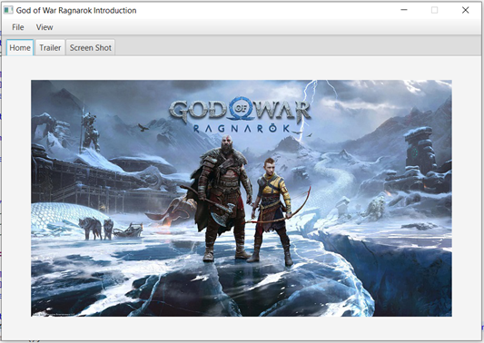
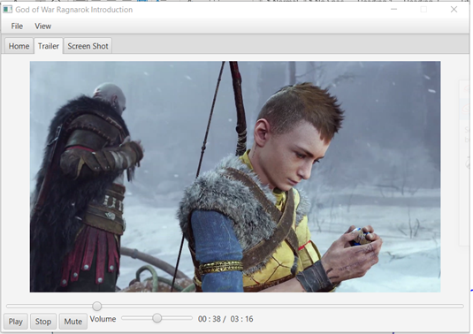
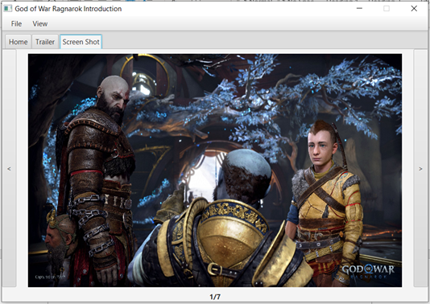
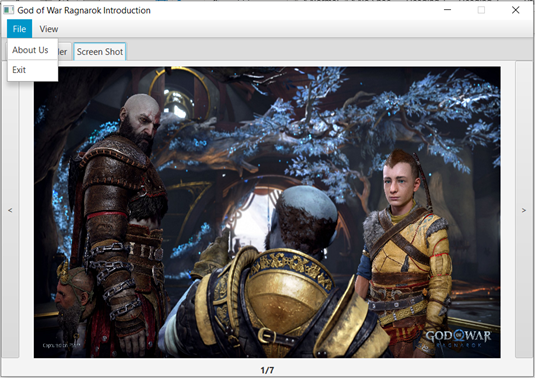
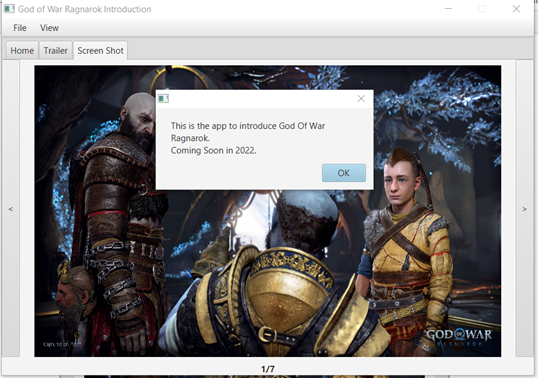
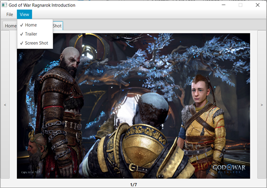
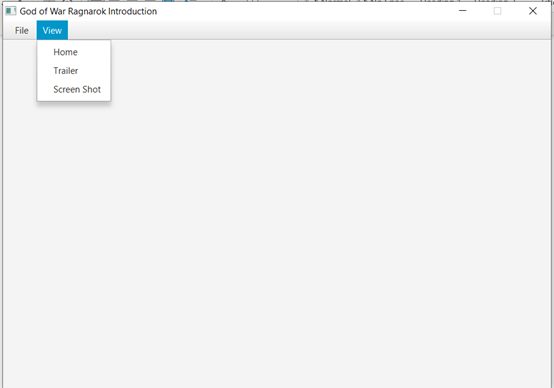
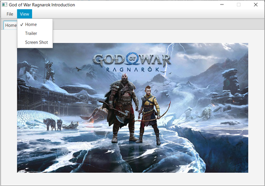

# JavaFX Multimedia App - God of War Ragnarok Introduction

This is a **JavaFX multimedia application** developed in Java using Eclipse as part of my coursework.  
The app introduces **God of War Ragnarok** with tabs for images, video trailer, and information, while demonstrating the use of **JavaFX UI components**.

## Features

- **Home Tab**: Displays the main poster of the game
- **Trailer Tab**: Plays the official game trailer with controls (Play, Pause, Stop, Mute, Volume, Progress Bar)
- **Screenshot Tab**: Browse multiple screenshots with navigation buttons
- **Menu Bar**:
  - _File → About Us_: Shows app details
  - _File → Exit_: Closes the app
  - _View_: Toggle tabs (Home, Trailer, Screenshot)

## Tech Stack

- **Language:** Java
- **Framework:** JavaFX
- **IDE:** Eclipse

## Screenshots

- **Home Page**:

  

- **Trailer Page**:

  

- **Screenshot Page**:

  

- **About Us to show app details**:

  
  

- **View to toggle tab(Home, Trailer, Screenshot)**:

  
  
  

## Important Note

The source code provided here is for **learning and showcase purposes only**.  
Some media files (images/videos) referenced in the code may be missing due to original paths being stored locally.  
You may need to replace them with your own resources to run the app.
